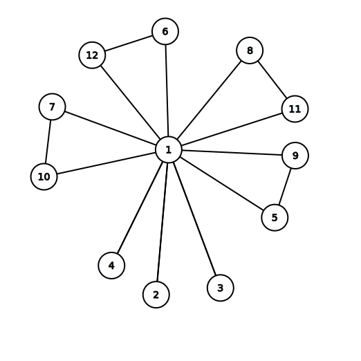
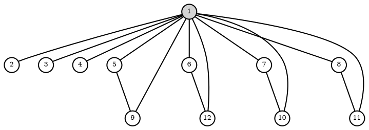
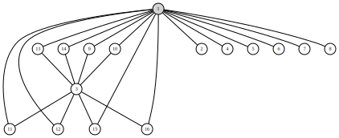
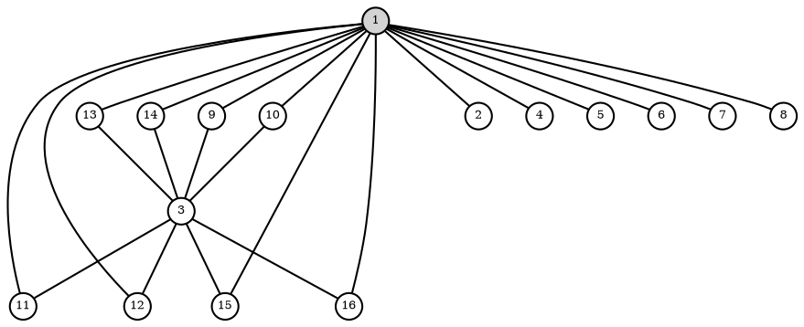
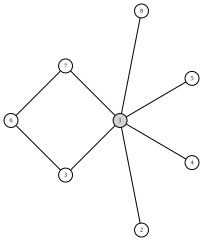
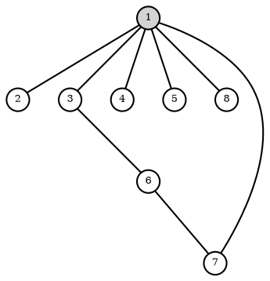
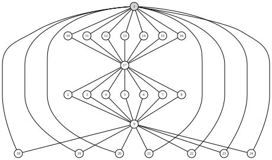
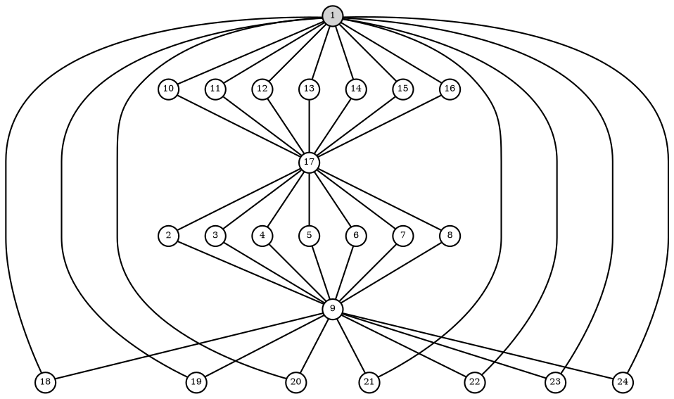

Finite Group Explorer
=====================

Heuristic search algorithms for [abelian](https://en.wikipedia.org/wiki/Abelian_group) and [non-abelian](https://en.wikipedia.org/wiki/Non-abelian_group) [small groups](https://en.wikipedia.org/wiki/List_of_small_groups).

My main motivation was the lack of similar heuristic programs on the internet. I was curious which are the biggest
groups that can be found this way, and how soon would one reach a combinatorial explosion on current CPUs. (This limit seems to be around order 10 for random search and 16-20 for the systematic.)

The plan is to develop this application to a simple tool that helps to find concrete examples of
groups mentioned in text books and to be able to generate their representations in many different formats.

# Modules

The underlying representation of the groups in each module is done by using [Cayley tables](https://en.wikipedia.org/wiki/Cayley_table). In addition to the Cayley table, the search algorithms are making use of bitmasks that summarize values appearing on a given row or column (etc.). This technique is used frequently in Chess engines.

| Module | Description |
| --- | --- |
| [LatinHeuristics.hpp](./LatinHeuristics.hpp) | Searches for [reduced latin squares](https://en.wikipedia.org/wiki/Latin_square#Reduced_form) and disregards the [associative rule](https://en.wikipedia.org/wiki/Group_(mathematics)#Definition). Its findings might be either quasigroups or groups when associativity appears by chance. |
| [AssocHeuristics.hpp](./AssocHeuristics.hpp) | Searches for proper groups by using the associative rule too. The results can be both abelian and non-abelian. |
| [RandomHeuristics.hpp](./CycleGraph.hpp) | Same as AssocHeuristics but the search is randomized. |
| [CycleGraph.hpp](./CycleGraph.hpp) | Generates the [Graphviz](https://en.wikipedia.org/wiki/Graphviz) code of the [Cycle Graph](https://en.wikipedia.org/wiki/Cycle_graph_(algebra)) of a group. |
| [Classifier.hpp](./Classifier.hpp) | Checks for properties of the group. |

# 1. Example result: A4

A4 non-abelian, alternating group, order 12.

## 1.2. Cycle graph

## 1.3. Generated Graphviz code of the graph

## 1.4. Cayley table

| | | | | | | | | | | | |
| - | - | - | - | - | - | - | - | - | - | - | - |
|1|2|3|4|5|6|7|8|9|10|11|12|
|2|1|4|3|6|5|8|7|10|9|12|11|
|3|4|1|2|7|8|5|6|11|12|9|10|
|4|3|2|1|8|7|6|5|12|11|10|9|
|5|7|8|6|9|11|12|10|1|3|4|2|
|6|8|7|5|10|12|11|9|2|4|3|1|
|7|5|6|8|11|9|10|12|3|1|2|4|
|8|6|5|7|12|10|9|11|4|2|1|3|
|9|12|10|11|1|4|2|3|5|8|6|7|
|10|11|9|12|2|3|1|4|6|7|5|8|
|11|10|12|9|3|2|4|1|7|6|8|5|
|12|9|11|10|4|1|3|2|8|5|7|6|

# 2. Example result: G166

Abelian, order 16, product. Z4 x Z22

## 2.1. Cycle graph

## 2.2. Generated Graphviz code of the graph

## 2.3. Cayley table

| | | | | | | | | | | | | | | | |
| - | - | - | - | - | - | - | - | - | - | - | - | - | - | - | - |
|1|2|3|4|5|6|7|8|9|10|11|12|13|14|15|16|
|2|1|4|3|6|5|8|7|10|9|12|11|14|13|16|15|
|3|4|1|2|7|8|5|6|11|12|9|10|15|16|13|14|
|4|3|2|1|8|7|6|5|12|11|10|9|16|15|14|13|
|5|6|7|8|1|2|3|4|13|14|15|16|9|10|11|12|
|6|5|8|7|2|1|4|3|14|13|16|15|10|9|12|11|
|7|8|5|6|3|4|1|2|15|16|13|14|11|12|9|10|
|8|7|6|5|4|3|2|1|16|15|14|13|12|11|10|9|
|9|10|11|12|13|14|15|16|3|4|1|2|7|8|5|6|
|10|9|12|11|14|13|16|15|4|3|2|1|8|7|6|5|
|11|12|9|10|15|16|13|14|1|2|3|4|5|6|7|8|
|12|11|10|9|16|15|14|13|2|1|4|3|6|5|8|7|
|13|14|15|16|9|10|11|12|7|8|5|6|3|4|1|2|
|14|13|16|15|10|9|12|11|8|7|6|5|4|3|2|1|
|15|16|13|14|11|12|9|10|5|6|7|8|1|2|3|4|
|16|15|14|13|12|11|10|9|6|5|8|7|2|1|4|3|

# 3. Example result: Dih4

Dih4: non-abelian, dihedral group, order 8, extraspecial group, nilpotent.

## 3.1. Cycle graph

## 3.2. Generated Graphviz code of the graph

## 3.3. Cayley table

| | | | | | | | |
| - | - | - | - | - | - | - | - |
|1|2|3|4|5|6|7|8|
|2|1|4|3|6|5|8|7|
|3|8|6|2|4|7|1|5|
|4|7|5|1|3|8|2|6|
|5|6|8|7|1|2|4|3|
|6|5|7|8|2|1|3|4|
|7|4|1|5|8|3|6|2|
|8|3|2|6|7|4|5|1|

# 4. Example result: G24

Abelian, order 24. This was found by accident, when I forgot to stop a program and it ran for around an hour.

## 4.1. Cycle graph

## 4.2. Generated Graphviz code of the graph

## 4.3. Cayley table

| | | | | | | | | | | | | | | | | | | | | | | | |
| - | - | - | - | - | - | - | - | - | - | - | - | - | - | - | - | - | - | - | - | - | - | - | - |
|1|2|3|4|5|6|7|8|9|10|11|12|13|14|15|16|17|18|19|20|21|22|23|24|
|2|1|4|3|6|5|8|7|10|9|12|11|14|13|16|15|18|17|20|19|22|21|24|23|
|3|4|1|2|7|8|5|6|11|12|9|10|15|16|13|14|19|20|17|18|23|24|21|22|
|4|3|2|1|8|7|6|5|12|11|10|9|16|15|14|13|20|19|18|17|24|23|22|21|
|5|6|7|8|1|2|3|4|13|14|15|16|9|10|11|12|21|22|23|24|17|18|19|20|
|6|5|8|7|2|1|4|3|14|13|16|15|10|9|12|11|22|21|24|23|18|17|20|19|
|7|8|5|6|3|4|1|2|15|16|13|14|11|12|9|10|23|24|21|22|19|20|17|18|
|8|7|6|5|4|3|2|1|16|15|14|13|12|11|10|9|24|23|22|21|20|19|18|17|
|9|10|11|12|13|14|15|16|17|18|19|20|21|22|23|24|1|2|3|4|5|6|7|8|
|10|9|12|11|14|13|16|15|18|17|20|19|22|21|24|23|2|1|4|3|6|5|8|7|
|11|12|9|10|15|16|13|14|19|20|17|18|23|24|21|22|3|4|1|2|7|8|5|6|
|12|11|10|9|16|15|14|13|20|19|18|17|24|23|22|21|4|3|2|1|8|7|6|5|
|13|14|15|16|9|10|11|12|21|22|23|24|17|18|19|20|5|6|7|8|1|2|3|4|
|14|13|16|15|10|9|12|11|22|21|24|23|18|17|20|19|6|5|8|7|2|1|4|3|
|15|16|13|14|11|12|9|10|23|24|21|22|19|20|17|18|7|8|5|6|3|4|1|2|
|16|15|14|13|12|11|10|9|24|23|22|21|20|19|18|17|8|7|6|5|4|3|2|1|
|17|18|19|20|21|22|23|24|1|2|3|4|5|6|7|8|9|10|11|12|13|14|15|16|
|18|17|20|19|22|21|24|23|2|1|4|3|6|5|8|7|10|9|12|11|14|13|16|15|
|19|20|17|18|23|24|21|22|3|4|1|2|7|8|5|6|11|12|9|10|15|16|13|14|
|20|19|18|17|24|23|22|21|4|3|2|1|8|7|6|5|12|11|10|9|16|15|14|13|
|21|22|23|24|17|18|19|20|5|6|7|8|1|2|3|4|13|14|15|16|9|10|11|12|
|22|21|24|23|18|17|20|19|6|5|8|7|2|1|4|3|14|13|16|15|10|9|12|11|
|23|24|21|22|19|20|17|18|7|8|5|6|3|4|1|2|15|16|13|14|11|12|9|10|
|24|23|22|21|20|19|18|17|8|7|6|5|4|3|2|1|16|15|14|13|12|11|10|9|

# TODO

- Add more tests into the classifier.
- Find a decent graph rendering tool.
