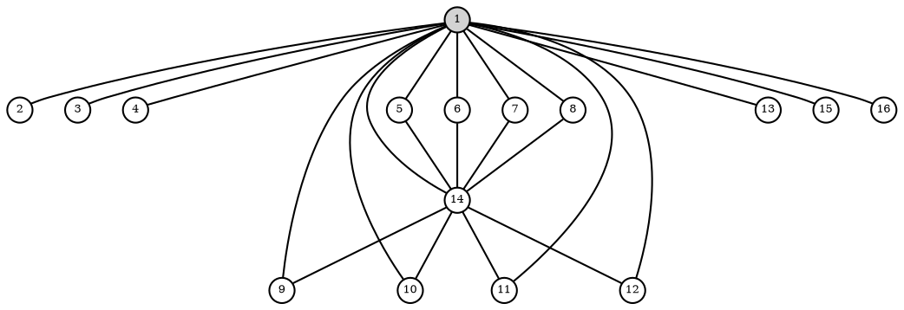

Finite Group Explorer
=====================

Heuristic search algorithms for [abelian](https://en.wikipedia.org/wiki/Abelian_group) and [non-abelian](https://en.wikipedia.org/wiki/Non-abelian_group) [small groups](https://en.wikipedia.org/wiki/List_of_small_groups).

My main motivation was the lack of similar heuristic programs on the internet. I was curious which are the biggest
groups that can be found this way, and how soon would one reach a combinatorial explosion on current CPUs. (This limit seems to be around order 20-22.)

The plan is to develop it to a simple tool that helps to find concrete examples of groups mentioned in text books and to be
able to generate its representation in many different formats.

# Modules

The underlying representation of the groups in each module is done by using [Cayley tables](https://en.wikipedia.org/wiki/Cayley_table). In addition to the Cayley table, the search algorithms are making use of bitmasks that summarize values appearing on a given row or column (etc.). This technique is used frequently in Chess engines.

| Module | Description |
| --- | --- |
| LatinHeuristics.hpp | Searches for [reduced latin squares](https://en.wikipedia.org/wiki/Latin_square#Reduced_form) and disregards the [associative rule](https://en.wikipedia.org/wiki/Group_(mathematics)#Definition). Its findings might be either quasigroups or groups when associativity appears by chance. |
| AssocHeuristics.hpp | Searches for proper groups by using the associative rule too. The results can be both abelian and non-abelian. |
| CycleGraph.hpp | Generates the [Graphviz](https://en.wikipedia.org/wiki/Graphviz) code of the [Cycle Graph](https://en.wikipedia.org/wiki/Cycle_graph_(algebra)) of a group. |

# Example result

The [main.cpp](./main.cpp) finds this abelian G16 group with order of 16.

## Cycle graph

## Generated Graphviz code

## Cayley table

| | | | | | | | | | | | | | | | |
| - | - | - | - | - | - | - | - | - | - | - | - | - | - | - | - |
|1|2|3|4|5|6|7|8|9|10|11|12|13|14|15|16|
|2|1|4|3|6|5|8|7|10|9|12|11|14|13|16|15|
|3|4|1|2|7|8|5|6|11|12|9|10|15|16|13|14|
|4|3|2|1|8|7|6|5|12|11|10|9|16|15|14|13|
|5|6|7|8|14|13|16|15|1|2|3|4|10|9|12|11|
|6|5|8|7|13|14|15|16|2|1|4|3|9|10|11|12|
|7|8|5|6|16|15|14|13|3|4|1|2|12|11|10|9|
|8|7|6|5|15|16|13|14|4|3|2|1|11|12|9|10|
|9|10|11|12|1|2|3|4|14|13|16|15|6|5|8|7|
|10|9|12|11|2|1|4|3|13|14|15|16|5|6|7|8|
|11|12|9|10|3|4|1|2|16|15|14|13|8|7|6|5|
|12|11|10|9|4|3|2|1|15|16|13|14|7|8|5|6|
|13|14|15|16|10|9|12|11|6|5|8|7|1|2|3|4|
|14|13|16|15|9|10|11|12|5|6|7|8|2|1|4|3|
|15|16|13|14|12|11|10|9|8|7|6|5|3|4|1|2|
|16|15|14|13|11|12|9|10|7|8|5|6|4|3|2|1|

# TODO

- Implement randomized heuristics
- Add more tests into the classifier.
- Find a decent graph rendering tool.
